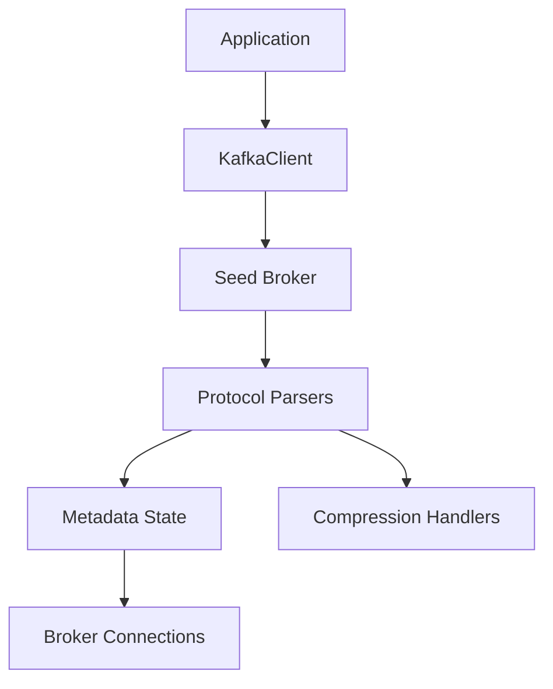

# Assumption Validation Check-In
- This repo is a synchronous Rust client library, not a broker or long-running network service; the main runtime trust boundary is untrusted broker traffic into local client processes.
- The highest-risk realistic attackers are a malicious broker, a compromised broker, or a network attacker when callers use plaintext Kafka or weaken TLS hostname verification.
- Production/runtime code under `src/` is in scope. Tests, fixtures, Docker compose, and examples are out of scope except where they clarify intended security usage.
- Threat priority is driven mainly by availability of client applications, integrity/confidentiality of fetched or produced data, and protection of SASL credentials in transit.
- I did not receive deployment-specific context such as whether callers always require TLS, whether brokers are only on private networks, or whether clients run in sensitive network zones.

Open questions that would materially change ranking:
- Do downstream users normally connect with `KafkaClient::new_secure(...)`, or is plaintext Kafka still a common deployment path?
- Are client processes allowed to reach sensitive internal hosts beyond the Kafka cluster, making broker-metadata host steering an SSRF concern?
- Are large or compressed Kafka messages expected in normal workloads, or should the library treat oversized responses as anomalous?

## Executive summary
The dominant security theme in `rs-kafka` is broker-controlled input handling. A malicious broker or MITM can influence frame sizes, nested collection lengths, compressed payloads, and metadata-advertised peer addresses before application code sees the data. Rust eliminates classic memory corruption in most paths, and the code already uses `UnexpectedEOF`, CRC checks, and some checked arithmetic, but several parser and metadata paths still allow process-level denial of service, host redirection, or conditional MITM exposure when TLS is not enforced or hostname verification is disabled.

## Scope and assumptions
- In scope: `src/client/*`, `src/codecs.rs`, `src/protocol/*`, `src/compression/*`, `src/error.rs`.
- Out of scope: `tests/`, `examples/`, Docker fixtures, CI/dev tooling, Kafka broker configuration itself.
- Assumptions:
  - Attackers cannot write local source code or alter Cargo dependencies directly.
  - Attackers can fully control bytes returned by a broker they operate or compromise.
  - Attackers can tamper on-path when callers use plaintext mode or explicitly disable TLS hostname verification.
  - Callers may run this client inside trusted internal networks, so outbound connections selected from broker metadata may have security impact.
- Open questions:
  - Whether plaintext Kafka remains an accepted production mode.
  - Whether clients are egress-restricted to known Kafka broker IPs.
  - Whether application operators expect hard memory caps for untrusted broker responses.

## System model
### Primary components
- `KafkaClient` is the central synchronous runtime component. It establishes broker connections, negotiates API versions, optionally authenticates with SASL, and performs metadata/fetch/produce/group operations (`src/client/mod.rs`, `src/client/network.rs`).
- `network::KafkaConnection` sends length-prefixed requests and allocates response buffers based on broker-supplied frame sizes (`src/client/network.rs`, `src/client/mod.rs`).
- Protocol decoders in `src/codecs.rs`, `src/protocol/zreader.rs`, and `src/protocol/*` parse Kafka strings, arrays, record batches, and metadata responses.
- TLS is optional and configured through `SecurityConfig`/`TlsConnector`; hostname verification is on by default but can be disabled (`src/client/tls.rs`).
- Compression handlers process gzip and snappy payloads during fetch-response parsing (`src/protocol/fetch.rs`, `src/protocol/records.rs`, `src/compression/*`).

### Data flows and trust boundaries
- Application -> `KafkaClient`
  - Data: broker seed hosts, topics, credentials, fetch/produce parameters.
  - Channel: in-process Rust API.
  - Security guarantees: caller-controlled configuration only.
  - Validation: limited semantic validation; many numeric settings are accepted as-is.
- `KafkaClient` -> seed broker
  - Data: metadata requests, API-version negotiation, SASL handshake, fetch/produce requests.
  - Channel: TCP or TLS.
  - Security guarantees: TLS only when caller chooses secure mode; hostname verification can be disabled via `with_hostname_verification(false)`.
  - Validation: request encoding is bounded by integer conversions, but peer trust is mostly transport-dependent.
- Broker -> parser/decoder
  - Data: frame lengths, arrays, strings, record batches, compressed payloads, metadata broker lists.
  - Channel: Kafka binary protocol.
  - Security guarantees: CRC validation for fetched messages/record batches when enabled; `UnexpectedEOF` and some checked arithmetic on batch boundaries.
  - Validation: incomplete. Several lengths are accepted and turned into allocations or loop bounds without an application-level size cap.
- Metadata response -> future outbound connections
  - Data: broker hostnames, ports, partition leaders, group coordinators.
  - Channel: parsed metadata structures.
  - Security guarantees: none beyond the trustworthiness of the broker/transport.
  - Validation: host and port values are trusted and later reused for new connections.

#### Diagram

## Assets and security objectives
| Asset | Why it matters | Security objective (C/I/A) |
| --- | --- | --- |
| SASL credentials | Theft allows broker impersonation or unauthorized cluster access | C |
| Message payloads fetched/produced through the client | Applications may rely on their correctness and secrecy | C/I |
| Client process availability | This library often runs in ingestion/consumer/producer paths; crashes or memory exhaustion disrupt workloads | A |
| Broker routing metadata | Determines where the client connects next; poisoning can redirect traffic | I/A |
| Client host network position | A library process may be able to reach internal services the attacker cannot reach directly | C/I/A |

## Attacker model
### Capabilities
- Operate or compromise a Kafka broker the client connects to.
- Modify Kafka traffic on-path when callers use plaintext mode or weaken TLS checks.
- Send malformed or oversized Kafka protocol fields, nested arrays, and compressed record payloads.
- Advertise arbitrary broker hostnames/ports in metadata or coordinator responses.

### Non-capabilities
- No assumed local code execution on the client host before exploitation.
- No assumed compromise of the Rust toolchain or crate supply chain.
- No assumed ability to bypass TLS certificate validation when callers keep secure mode and hostname verification enabled.

## Entry points and attack surfaces
| Surface | How reached | Trust boundary | Notes | Evidence (repo path / symbol) |
| --- | --- | --- | --- | --- |
| Response frame size allocation | Any broker response | Broker -> network reader | Size prefix is trusted and fed directly into allocation | `src/client/network.rs` `read_exact_alloc`; `src/client/mod.rs` `__get_response`; `src/client/network.rs` `__get_response` |
| Nested strings/arrays/bytes decoding | Metadata, API versions, protocol structs | Broker -> generic codecs | Positive lengths trigger `reserve` and loops with no global cap | `src/codecs.rs` `FromByte for String/Vec/V`; `src/protocol/zreader.rs` |
| Fetch record parsing | Fetch responses | Broker -> fetch parser | Parses nested record sets and compressed messages; uses `unsafe` lifetime extension | `src/protocol/fetch.rs` `Response::from_vec`, `MessageSet::from_vec`, `from_record_set_slice` |
| Compression handlers | Compressed fetch records | Broker -> decompressor | Gzip/snappy output is effectively unbounded; snappy chunk lengths can panic | `src/compression/snappy.rs` `next_chunk`, `read_to_end_inner`; `src/compression/gzip.rs` `uncompress` |
| Metadata broker routing | Metadata and coordinator responses | Broker -> client state -> outbound TCP/TLS | Advertised hosts are trusted for future connections | `src/protocol/metadata.rs`; `src/client/state.rs` `update_brokers`, `set_group_coordinator`, `find_broker` |
| TLS configuration | Caller configuration + network | Caller/network -> transport | Secure defaults exist, but plaintext mode and hostname-verification bypass remain available | `src/client/tls.rs` `SecurityConfig::new`, `with_hostname_verification`, `NoHostnameVerification` |

## Top abuse paths
1. Attacker controls a broker or MITM position -> sends a negative or huge response size -> client casts it to `u64`/`usize` and allocates -> application aborts or exhausts memory before protocol parsing begins.
2. Attacker returns metadata with many large arrays/strings -> generic decoders repeatedly `reserve` and iterate on attacker-chosen counts -> client spends memory and CPU parsing metadata or fetch results.
3. Attacker returns a crafted snappy response with chunk length larger than remaining input -> `SnappyReader` slices past buffer bounds -> process panics during fetch parsing.
4. Attacker returns highly compressed but enormous gzip/snappy data -> decompressor expands attacker-controlled output into memory -> client process is memory-starved or killed.
5. Malicious seed broker or plaintext MITM advertises attacker-chosen broker hosts -> client stores them in metadata state -> later fetch/produce/group operations connect to those hosts from the client’s network position.
6. Attacker tampers with plaintext Kafka or exploits disabled hostname verification -> intercepts SASL/PLAIN credentials or injects forged protocol responses -> confidentiality and integrity of cluster traffic are lost.
7. Malicious metadata includes sparse, negative, or oversized partition IDs -> `update_metadata` indexes `tps[partition.id as usize]` without validating the ID -> client panics while refreshing cluster state.
8. Attacker sends malformed record batches around `unsafe` lifetime-transmute paths -> current ownership pattern appears intentional, but any future refactor that breaks the "own backing buffer for all borrowed slices" invariant could turn parser bugs into memory-safety issues.

## Threat model table
| Threat ID | Threat source | Prerequisites | Threat action | Impact | Impacted assets | Existing controls (evidence) | Gaps | Recommended mitigations | Detection ideas | Likelihood | Impact severity | Priority |
| --- | --- | --- | --- | --- | --- | --- | --- | --- | --- | --- | --- | --- |
| TM-01 | Malicious broker or MITM | Ability to send broker responses | Send oversized or negative frame sizes and large nested lengths | Memory exhaustion, panic, high CPU | Client availability | Rust memory safety; `UnexpectedEOF` handling; some checked arithmetic in record parsing (`src/protocol/records.rs`) | No top-level response-size cap; `read_exact_alloc` trusts frame size; generic decoders `reserve` on attacker-controlled counts (`src/client/network.rs`, `src/codecs.rs`) | Reject negative sizes and enforce configurable hard caps for frame size, string length, bytes length, array length, and decompressed size before allocation | Emit metrics/logs for rejected frame sizes and decode-limit violations | High | High | High |
| TM-02 | Malicious broker | Ability to send compressed fetch payloads | Trigger snappy panic or compression bomb | Crash or memory exhaustion during fetch | Client availability | CRC validation optional/default-on for fetched messages (`src/client/mod.rs` default CRC true; `src/protocol/fetch.rs`; `src/protocol/records.rs`) | `SnappyReader` lacks remaining-length check before slicing; gzip/snappy decompression has no output cap (`src/compression/snappy.rs`, `src/compression/gzip.rs`) | Add explicit chunk-bound checks, return `UnexpectedEOF` instead of panicking, and cap total decompressed bytes per message/batch/response | Log decompression errors separately from generic I/O; surface counters for compression ratio anomalies | High | High | High |
| TM-03 | Malicious broker or plaintext MITM | Ability to influence metadata/coordinator responses | Advertise attacker-controlled broker hosts/ports and leaders | Outbound connection redirection, possible SSRF, traffic interception, workflow disruption | Broker routing metadata, client network position, message confidentiality/integrity | Initial seed hosts must be provided by caller; TLS secure mode exists (`src/client/mod.rs`, `src/client/tls.rs`) | Metadata hosts are trusted without allowlisting or origin binding and later reused for fetch/produce/group requests (`src/client/state.rs`, `src/client/mod.rs`) | Offer optional broker allowlist/IP pinning against seed hosts, validate advertised brokers against expected domains/CIDRs, and expose hooks so callers can reject metadata endpoints | Warn when metadata introduces new hosts outside the configured seed set or expected suffix/CIDR | Medium | High | High |
| TM-04 | Network attacker or unsafe deployment | Plaintext mode or hostname verification disabled | Intercept traffic, steal SASL/PLAIN credentials, forge broker responses | Credential compromise, data tampering, cluster impersonation | SASL credentials, message integrity/confidentiality | `SecurityConfig::new` defaults to hostname verification; TLS connector validates roots by default (`src/client/tls.rs`) | Plaintext `KafkaClient::new(...)` remains available; API explicitly exposes `with_hostname_verification(false)` via dangerous verifier path | Keep secure mode as documented default, add prominent "insecure transport" warnings in docs/logging, and consider feature-gating or renaming hostname-bypass API to make risk explicit | Log when secure mode is not used or hostname verification is disabled | Medium | High | High |
| TM-05 | Malicious broker | Ability to send malformed metadata | Use negative/large partition IDs that do not match vector shape | Process panic during metadata refresh | Client availability | None beyond Rust bounds checks converting bug into panic rather than memory corruption | `update_metadata` indexes `tps[partition.id as usize]` without validating range or sign (`src/client/state.rs`) | Validate partition IDs before indexing; reject sparse or out-of-range metadata with a typed parse error | Log metadata-shape validation failures with broker identity and correlation id | Medium | Medium | Medium |
| TM-06 | Future maintainer mistake plus malicious broker input | Code changes around fetch parser ownership | Break backing-buffer ownership assumptions around `transmute` lifetimes | Potential future memory-unsafety regression | Client integrity/availability | Current code keeps owning `Vec<u8>`/`Cow` alive alongside borrowed slices (`src/protocol/fetch.rs`) | Safety invariant is implicit and not mechanically enforced; multiple `unsafe` transmute sites remain audit-sensitive | Replace lifetime transmute with self-referential-free owned structures or add explicit safety comments/tests protecting the invariant | Add regression tests that mutate parser internals only through safe API and run Miri in CI if feasible | Low | High | Medium |

## Mitigations and recommendations
- Existing mitigations
  - Kafka message corruption checks are present through CRC validation and are enabled by default for fetches (`src/client/mod.rs`, `src/protocol/fetch.rs`, `src/protocol/records.rs`).
  - Several batch parsers use `checked_add`/EOF handling to avoid integer wrap and short-read confusion (`src/protocol/records.rs`).
  - TLS defaults are reasonably strong when callers opt in: root validation is enabled and hostname verification defaults to true (`src/client/tls.rs`).
  - API version negotiation narrows the client to protocol versions it explicitly supports (`src/client/network.rs` `negotiate_api_versions`).
- Key gaps
  - No central upper bound for response-frame size, nested collection length, or decompressed output size.
  - Metadata and coordinator responses are trusted as authoritative routing data with no policy hook.
  - One malformed snappy chunk can currently panic the process instead of returning a parse error.
  - Unsafe parser lifetime invariants are not documented strongly enough for future maintainers.
- Recommended focus path
  - First: add configurable hard caps around all attacker-controlled lengths before allocation.
  - Second: make compression parsing fail closed on chunk-bound errors and decompression expansion limits.
  - Third: validate metadata shape and optionally broker addresses before adding them to client state.
  - Fourth: reduce or document `unsafe` lifetime transmute invariants.

## Focus paths for manual security review
- `src/client/network.rs`: top-level response framing, frame-size trust, connection setup, and API negotiation.
- `src/codecs.rs`: generic length-prefixed decoding logic that shapes allocation behavior across many protocol structs.
- `src/protocol/zreader.rs`: low-level bytes/array/string reader used heavily by fetch parsing.
- `src/protocol/fetch.rs`: nested parsing, compression handling, and `unsafe` lifetime extensions.
- `src/protocol/records.rs`: record-batch bounds checks, CRC behavior, and decompression flow.
- `src/compression/snappy.rs`: malformed-chunk panic surface and decompression amplification risk.
- `src/compression/gzip.rs`: unbounded decompression into memory.
- `src/protocol/metadata.rs`: broker/partition metadata fields that later drive routing.
- `src/client/state.rs`: metadata integration, unchecked partition indexing, and host redirection logic.
- `src/client/tls.rs`: transport guarantees, hostname verification bypass, and SNI/server-name handling.
- `src/client/sasl.rs`: credential handling and PLAIN-mechanism behavior.

## Quality check
- All discovered runtime entry points are covered: connection framing, protocol decoders, compression handlers, metadata routing, and TLS/SASL transport.
- Each major trust boundary appears in at least one abuse path and one threat row.
- Runtime code is separated from tests/examples/dev tooling.
- No user clarifications were provided; conclusions that depend on deployment choices are marked as assumptions.
- Assumptions and open questions are explicit at the top of the report.
